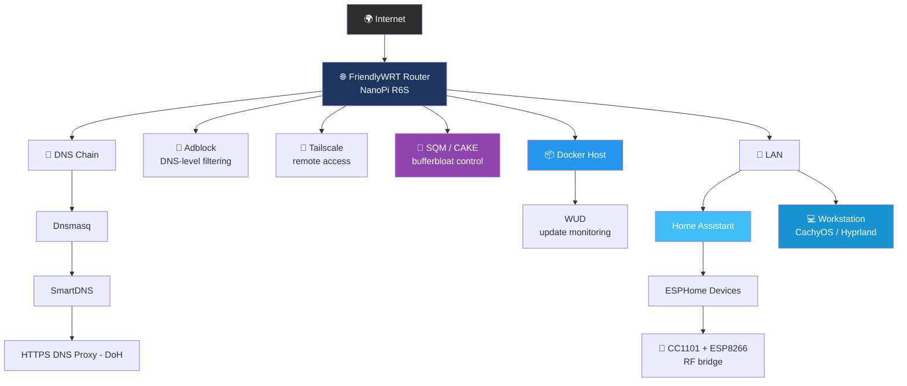

# 🏠 Homelab

Documentation of my personal homelab — network infrastructure, container management, home automation, and workstation setup.

Every section answers three questions: **what** was built, **why** that approach was chosen over the alternatives, and **what it actually delivers** in day-to-day operation.

> 🔒 This repository contains no IP addresses, hostnames, credentials, port bindings, or other operational details. It documents architecture and reasoning, not configuration that could be replayed against the environment it describes.

---

## 📊 Overview

| Layer | Technology | Status | What it delivers |
|---|---|---|---|
| 🌐 Router / Network OS | FriendlyWRT (NanoPi R6S) | ✅ Active | Full control over NAT, firewall, and routing instead of an opaque ISP-supplied device |
| 🔗 DNS Chain | Dnsmasq → SmartDNS → DoH | ✅ Active | Encrypted, cached, unbypassable name resolution for every device on the network |
| 🚫 Ad/Content Blocking | Adblock (OpenWrt) | ✅ Active | Network-wide filtering with zero client-side setup — covers phones, TVs, and IoT devices alike |
| 🚦 QoS | SQM / CAKE | ✅ Active | Latency stays usable during heavy uploads; video calls and gaming no longer degrade |
| 📦 Container Management | Docker + WUD | ✅ Active | Update visibility across the stack without surrendering control to unattended auto-updates |
| 🏡 Home Automation | Home Assistant + ESPHome | 🔧 In progress | Platform is running; device integrations are still being built out |
| 📡 RF Integration | CC1101 + ESP8266 | 🔧 In progress | RF capture working; transmit path not yet verified |
| 💻 Workstation | CachyOS + Hyprland | 🔧 In progress | Daily driver running; Secure Boot and snapshot automation still open |

---

## 🧭 Architecture

---

## 📂 Contents
 
| Folder | Status | What's documented |
|:---|:---:|---|
| 📡&nbsp;[`network/`](./network) | ✅&nbsp;Complete | The router: WAN termination, the layered DNS chain and why each layer exists, firewall zone design, QoS, kernel and boot&#8209;time tuning, and monitoring — with the reasoning and the measurable outcome for each decision. |
| 📦&nbsp;[`docker/`](./docker) | ✅&nbsp;Complete | The container stack (Home Assistant, MQTT, ESPHome, WUD), why host networking was chosen, the deliberate "notify, don't auto&#8209;update" policy — plus an honest backlog of known gaps. |
| 🏡&nbsp;[`smart‑home/`](./smart-home) | 🚧&nbsp;In&nbsp;progress | RF&#8209;controlled roller blind automation: current progress, what's blocking, and the broader sensor/automation roadmap it's meant to be the foundation for. |
| 💻&nbsp;[`workstation/`](./workstation) | 🚧&nbsp;In&nbsp;progress | CachyOS + Hyprland daily driver: why each component was chosen, and the open items (Secure Boot, snapshot automation) still to be closed. |

---

## 💡 Why This Project Exists

I work in IT infrastructure and systems support and I'm moving toward cloud engineering. A homelab is where I get to make architectural decisions end-to-end and then live with the consequences — something that's hard to practise in a production environment where the design is already set and mistakes are expensive.

The problems here are small-scale versions of real ones: layered DNS architecture and resolver bypass prevention, firewall zone segmentation, container lifecycle and update policy, storage layout on constrained hardware, and IoT integration. Getting them wrong has visible consequences (the internet stops working, the blinds don't move), which makes it a fast feedback loop.

**What this repository is meant to show** isn't a list of installed software — it's the reasoning behind each choice, the trade-offs accepted, and an honest account of what isn't finished yet.

---

## 🛠️ Technologies

`OpenWrt/FriendlyWRT` · `nftables` · `Dnsmasq` · `SmartDNS` · `DNS-over-HTTPS` · `Adblock` · `SQM/CAKE` · `Docker` · `WUD` · `Home Assistant` · `ESPHome` · `Mosquitto/MQTT` · `CC1101` · `Tailscale` · `CachyOS` · `Hyprland` · `Btrfs`

---

## 📄 License

Released under the MIT License — see [`LICENSE`](./LICENSE). These are notes and architectural descriptions rather than deployable configuration; adapt anything here to your own security requirements before relying on it.
