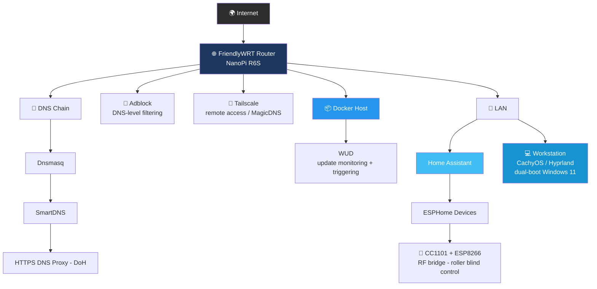

# 🏠 Homelab

Documentation of my personal homelab environment — network infrastructure, container management, and home automation.

> 🔒 This repository does not include real IP addresses, hostnames, credentials, or other sensitive data. The goal is to share the architecture and the problems solved, not the exact configuration.

---

## 📊 Overview

| Layer | Technology | Status |
|---|---|---|
| 🌐 Router / Network OS | FriendlyWRT (NanoPi R6S) | ✅ Active |
| 🔗 DNS Chain | Dnsmasq → SmartDNS → HTTPS DNS Proxy (DoH) | ✅ Active |
| 🚫 Ad/Content Blocking | Adblock (OpenWrt) | ✅ Active |
| 📦 Container Management | Docker + WUD (What's Up Docker) | ✅ Active |
| 🏡 Home Automation | Home Assistant + ESPHome | 🔧 In progress |
| 📡 RF Integration | CC1101 + ESP8266 (ESPHome) | 🔧 Capture working, transmit path being verified |
| 💻 Desktop / Workstation | CachyOS (Arch-based) + Hyprland | ✅ Active |

---

## 🧭 Architecture

---

## 📂 Contents

| Folder | Description |
|---|---|
| 📡 [`network/`](./network) | Multi-layer DNS chain setup on FriendlyWRT, Adblock integration, issues encountered (Tailscale MagicDNS conflict, `no-resolv` configuration) and their solutions. |
| 📦 [`docker/`](./docker) | Container update monitoring and management with WUD. |
| 🏡 [`smart-home/`](./smart-home) | RF-based roller blind control with ESPHome + CC1101; Sonoff RF Bridge R2 / Portisch firmware process. |
| 💻 [`workstation/`](./workstation) *(optional)* | CachyOS + Hyprland setup, Secure Boot configuration. |

---

## 💡 Why This Project?

I work in IT infrastructure and systems support, and this homelab is a small-scale but real-world exercise in problems also found in production environments: DNS architecture, container lifecycle management, IoT integration, and secure boot configuration. Each folder's README covers not just **what** I did, but **why** I did it this way and **what problems** I ran into along the way.

---

## 🛠️ Technologies Used

`OpenWrt/FriendlyWRT` · `Dnsmasq` · `SmartDNS` · `HTTPS DNS Proxy` · `Docker` · `WUD` · `Home Assistant` · `ESPHome` · `CC1101` · `Tailscale` · `CachyOS` · `Hyprland` · `Btrfs`

---

## 📄 License

The configuration examples and notes in this repository are for personal use and reference. Consider your own security and privacy requirements before applying anything here to your own environment.
