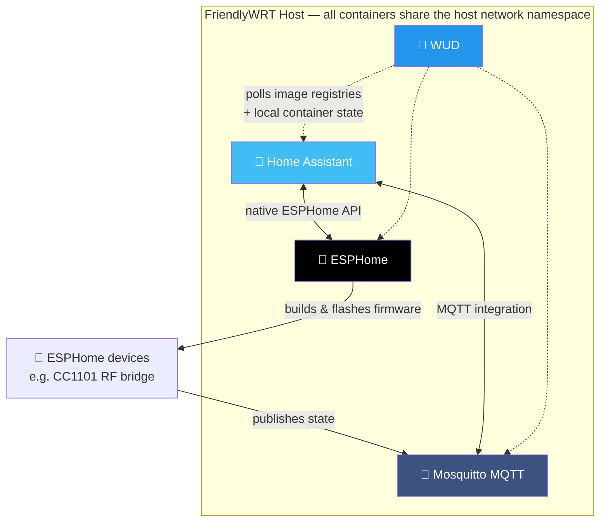

# 📦 Docker — Container Stack & Update Management

Four containers form the home-automation backbone of this homelab, running on the same FriendlyWRT host described in [`network/`](../network). Containers were originally created ad-hoc through DockerMan's web UI rather than from a compose file, so the running fleet is periodically reverse-engineered into a `docker-compose.yml` using [`docker-autocompose`](https://github.com/Red5d/docker-autocompose) — turning an undocumented, manually-assembled stack into something reproducible.

> ⚠️ This document describes architecture and design decisions. Port bindings, privilege flags, socket paths, and authentication details are intentionally omitted.

## 🗺️ Stack Overview



| Container | Image | Version | Role |
|---|---|---|---|
| 🏡 `homeassistant` | Home Assistant Core (aarch64) | 2026.7.3 | Automation engine & dashboard |
| 📨 `mosquitto` | `eclipse-mosquitto` | 2.1.2 | MQTT message broker |
| 🔧 `esphome` | `esphome/esphome:stable` | 2026.7.0 | ESP device compiler & dashboard |
| 🔄 `wud` | `getwud/wud` | 8.3.0 | Container update monitoring |

---

## 🌐 Why Host Networking Everywhere

All four containers share the host's network namespace rather than using Docker's default bridge. This is a deliberate trade-off:

- **Home Assistant and ESPHome depend on mDNS and SSDP** for device discovery — ESPHome nodes announcing themselves on the LAN, and Home Assistant discovering Chromecasts, HomeKit devices, and similar integrations. Docker's bridge network NATs traffic and does not forward multicast, which silently breaks discovery in ways that are frustrating to diagnose (devices simply never appear). Host networking avoids this entirely, without needing a macvlan network or maintaining per-integration port mappings.
- **The MQTT broker must be reachable by LAN devices** as though it were a bare-metal service, rather than through Docker's NAT layer.
- **The cost is namespace isolation.** These containers no longer have independent network stacks. That's acceptable here because all four are trusted, self-operated services rather than arbitrary third-party workloads — but it's a conscious trade, not a default.

A side effect worth noting: because host networking is in use, the `expose:` declarations that `docker-autocompose` emits are inert — `expose` is a bridge-network concept and has no effect in this mode. Services bind directly to host ports.

## 🏡 Home Assistant

- Runs with **elevated device access**, which is required for local hardware integrations — USB radio adapters (Zigbee/Z-Wave) and Bluetooth need direct device visibility that Docker's default restricted device set doesn't provide. This elevation is scoped to this one container; the other three run without it.
- Config is bind-mounted from the host, so `configuration.yaml`, automations, and the history database persist independently of the container lifecycle and can be edited or backed up directly from the filesystem.
- Uses the **s6-overlay** init system from Home Assistant's base image, which supervises multiple internal services (the core process, its supervisor hooks, and the wheel-installer) inside a single container.

## 📨 Mosquitto — The Integration Bus

- Acts as the MQTT broker linking **ESPHome devices → Home Assistant**. This runs *alongside* Home Assistant's native ESPHome API integration rather than replacing it — having both transports available means device state can be consumed via whichever path a given ESPHome component supports best.
- Started with an **explicit configuration file** rather than the image's defaults, mounted from the host so broker settings are editable and version-controllable.
- **Config and data are separate volumes**, so broker configuration can be changed without touching persisted retained messages and subscription state.

## 🔧 ESPHome

- Runs in **dashboard mode**, providing the web UI used to author, compile, and OTA-flash firmware for the ESP8266/ESP32 devices in the smart-home setup — including the CC1101 RF bridge documented in [`smart-home/`](../smart-home).
- The config directory is bind-mounted, so device YAML definitions and the build cache live on the host. The build cache matters: ESPHome compiles firmware from source, and losing the cache means every subsequent build recompiles the entire toolchain output from scratch.

## 🔄 WUD — Notify, Don't Auto-Update

WUD watches container images and surfaces available updates, but is deliberately configured **not** to apply them:

| Setting | Value | Reasoning |
|---|---|---|
| Watch schedule | Daily (cron, midnight) | Once a day is sufficient; more frequent polling adds registry traffic for no benefit |
| Trigger threshold | `all` | Evaluate every watched container, not just major/minor version bumps |
| Image prune | `true` | Reclaim superseded image layers automatically — important on constrained eMMC storage |
| Auto-apply | **`false`** | The core decision — see below |

**Why `auto = false`:** in a home-automation stack, an unattended overnight update can silently break RF device integrations or trigger a Home Assistant config migration that requires manual intervention. Discovering that the blinds stopped responding because a container updated itself at 03:00 is a far worse outcome than applying updates manually a few days late. WUD's job here is *visibility*, not automation.

**Digest watching is enabled selectively**, only on `esphome` and `mosquitto`. Both track floating tags (`stable` and `latest`), where the underlying image can change without the tag changing — digest comparison is the only way to detect that. It is deliberately not enabled on `wud` itself, to avoid the tool watching its own image.

WUD requires access to the local Docker API in order to enumerate containers and compare image digests. This is inherent to what the tool does, and is the reason it is treated as a privileged component of the stack rather than an ordinary service.

---

## 📂 Storage Layout

All persistent data lives under `/opt/docker/` — the dedicated eMMC partition described in [`network/README.md`](../network/README.md#-docker-host), which keeps container storage entirely off the OpenWrt firmware overlay.

```
/opt/docker/
├── homeassistant/config/   # configuration.yaml, automations, history DB
├── mosquitto/
│   ├── config/             # mosquitto.conf
│   └── data/               # persisted retained messages & subscriptions
└── esphome/                # device YAML definitions, build cache
```

All four containers use `restart: unless-stopped`, so the stack recovers automatically after a host reboot or daemon restart while still honouring a deliberate manual stop.

---

## 🧭 Known Gaps & Backlog

Documenting a homelab honestly means documenting what isn't finished. These are real, identified issues in the current stack:

- **No log rotation is configured.** All four containers use the default `json-file` logging driver with no `max-size` or `max-file` limits, meaning container logs grow without bound. On an embedded device with finite eMMC this is a genuine risk — and an inconsistency with the router side, where log growth in tmpfs is already actively capped (see [`network/`](../network/README.md#️-system--performance-tuning)). Setting per-container log limits, or a daemon-wide default in `daemon.json`, is the fix.
- **No resource limits.** No memory or CPU constraints are set on any container. A runaway process could starve the host — which is not just a NAS, but the router handling all network traffic. Bounding Home Assistant's memory in particular is the highest-value change here.
- **No health checks.** Containers restart on process exit, but a hung-but-running service (an MQTT broker that stops accepting connections, for example) won't be detected or recovered automatically.
- **`latest` tags in use** for Mosquitto and WUD. Combined with WUD's digest watching this is *visible* rather than silent, but pinning to explicit versions would make rollbacks deterministic.
- **The Home Assistant image carries no repository tag**, only a digest reference. This is why tag-based digest watching isn't meaningful for it, and it makes the image's provenance harder to read at a glance. Re-pulling against an explicit version tag would restore that.
- **The generated compose file is not directly re-deployable as-is.** `docker-autocompose` emits the legacy `version:` key (obsolete in Compose V2) and, because one volume was auto-created by Docker rather than named explicitly, declares it as `external: true` — meaning a fresh `docker compose up` on a clean host would fail until that volume is defined properly. The generated file is currently a *documentation artifact*, not yet a deployment artifact. Converting it into a genuinely reproducible stack is the next step.
- **Timezone is set explicitly on three of four containers** but not on Mosquitto, so its log timestamps are offset from the rest of the stack — a small thing that makes cross-container log correlation unnecessarily annoying.
- **No update notifications are configured.** WUD surfaces pending updates in its dashboard only; there's no push notification path, so noticing an update still requires actively looking. Wiring a notification trigger would close the loop on the notify-don't-automate design.

---

## 🛠️ Stack

`Docker` · `WUD (What's Up Docker)` · `Home Assistant` · `ESPHome` · `Eclipse Mosquitto (MQTT)` · `docker-autocompose` · `s6-overlay`
