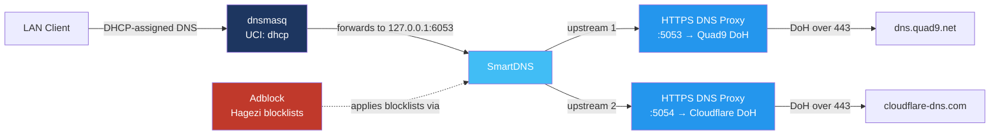
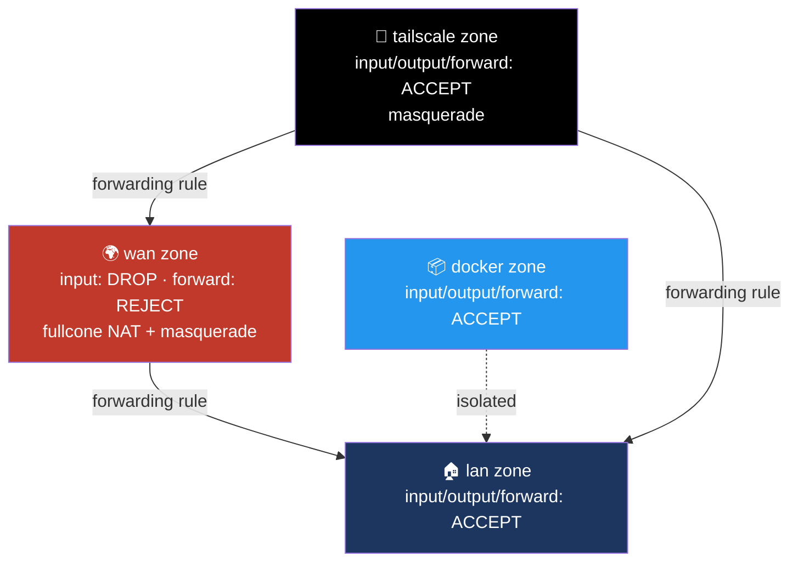

# 📡 Network — Multi-Layer DNS Chain on FriendlyWRT

> ⚠️ All IP addresses, hostnames, MAC addresses, and credentials shown below are illustrative placeholders — not real values from my network.

## 🎯 Goal

Build a DNS resolution path that is simultaneously:
- **Encrypted** end-to-end (DNS-over-HTTPS to the upstream resolver)
- **Filtered** at the network level (ad/tracker blocking for every device on the LAN, no per-device setup)
- **Fast**, using local caching and dual-stack (IPv4/IPv6) resolution
- **Transparent** to every device on the LAN — no client-side configuration required, and no way to bypass it by pointing a device at a different DNS server

## 🔗 The DNS Chain

### 1️⃣ dnsmasq — DHCP + first-hop resolver

- Handles DHCP leasing and local hostname resolution for the `.lan` domain.
- `noresolv` is enabled and `/etc/dnsmasq.conf` sets `no-resolv` — this stops dnsmasq from reading `/etc/resolv.conf` and picking up any DNS servers handed out by the ISP over PPPoE/DHCP. Every query is forced through the chain below instead.
- All non-local queries are forwarded to `127.0.0.1#6053` — i.e. straight to SmartDNS, nothing leaks to the WAN-provided resolver.

### 2️⃣ SmartDNS — caching + dual-stack resolution layer

- Listens on port `6053` (with a secondary instance on `6553` for redundancy/testing).
- Configured with `dualstack_ip_selection` to pick the best-performing A/AAAA record, `serve_expired` + `cache_persist` to keep answering from cache during upstream hiccups, and `force_https_soa` to prefer HTTPS-friendly responses.
- Forwards to **two independent upstream resolvers**, each pointed at a local HTTPS DNS Proxy instance rather than directly at a public IP — this is what makes the next layer possible.
- Also acts as the enforcement point for **Adblock**: `adb_dns 'smartdns'` and `adb_dnsinstance '6053'` tell Adblock to inject its blocklists here, so filtering happens once, centrally, for the whole LAN.

### 3️⃣ HTTPS DNS Proxy — DNS-over-HTTPS termination

- Two independent instances are run side by side:
  - Port `5053` → bootstraps via Quad9's resolver IPs, then queries `https://dns.quad9.net/dns-query`
  - Port `5054` → bootstraps via Cloudflare's resolver IPs, then queries `https://cloudflare-dns.com/dns-query`
- Running two upstreams means SmartDNS can race or fail over between them rather than depending on a single provider.
- `force_dns` is enabled with `force_dns_port 53` and `853`, scoped to the `lan` interface — this transparently redirects **any** device that tries to hardcode a different DNS server (53) or DNS-over-TLS (853) back into this chain. Combined with `notrack_dns`, this keeps DNS traffic out of the firewall's connection tracking table.

### 🚫 Adblock — network-wide filtering

- Uses the **Hagezi** "ultimate" blocklist feed, applied directly at the SmartDNS instance (`adb_dnsinstance '6053'`) rather than at the dnsmasq layer.
- Because filtering happens at the SmartDNS hop and `force_dns` prevents bypass, every device on the LAN is covered without installing anything client-side.

## 🐛 Problems Solved Along the Way

- **Tailscale MagicDNS conflict**: Tailscale's MagicDNS wants to inject its own DNS resolution for the tailnet, which collided with the `force_dns` redirection rule above — devices intermittently got the wrong resolver for tailnet hostnames. Resolved by scoping `force_dns_src_interface` explicitly to `lan` so the Tailscale interface's own DNS traffic isn't hijacked by the same rule meant for regular LAN clients.
- **`no-resolv` misconfiguration**: without `no-resolv` set correctly on the dnsmasq side, dnsmasq would fall back to whatever DNS the PPPoE WAN session handed out whenever SmartDNS was briefly unreachable — silently defeating the entire encrypted chain. Explicitly forcing `noresolv` closes that fallback path.

## 🧱 Firewall Zones

- **Defaults are deny-by-default on input/forward**: global `input REJECT` / `forward REJECT`, with `synflood_protect` and `drop_invalid` enabled — the WAN zone specifically overrides this to `input DROP` (silently drop rather than reject, so the router doesn't respond to unsolicited probes at all).
- **`wan` zone** uses `fullcone4`/`fullcone6` NAT and masquerading, which improves compatibility for peer-to-peer traffic (VoIP, gaming, some P2P protocols) compared to the default symmetric NAT.
- **A dedicated `docker` zone** keeps container network traffic in its own firewall context rather than lumping it into `lan`, so container-to-LAN and container-to-WAN access can be reasoned about (and restricted) independently of regular LAN clients.
- **A dedicated `tailscale` zone** is bound directly to the `tailscale0` device with its own masquerade rule, and has explicit forwarding rules to both `lan` and `wan` — this is what allows tailnet devices to reach both local LAN resources and get routed out to the internet (exit-node style) through the same box.
- Standard WAN-side allowances are kept minimal: DHCP renewal, ping, IGMP, ICMPv6 (needed for IPv6 to function correctly per RFC), and IPSec/ISAKMP passthrough — everything else inbound is dropped by default.

## 🛠️ Stack

`OpenWrt/FriendlyWRT` · `dnsmasq` · `SmartDNS` · `HTTPS DNS Proxy` · `Adblock (Hagezi)` · `Tailscale` · `nftables`
