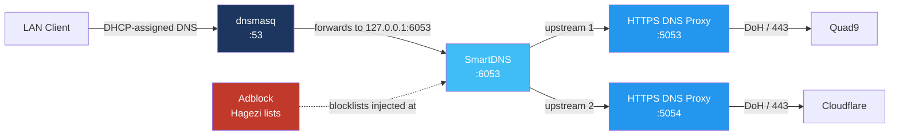
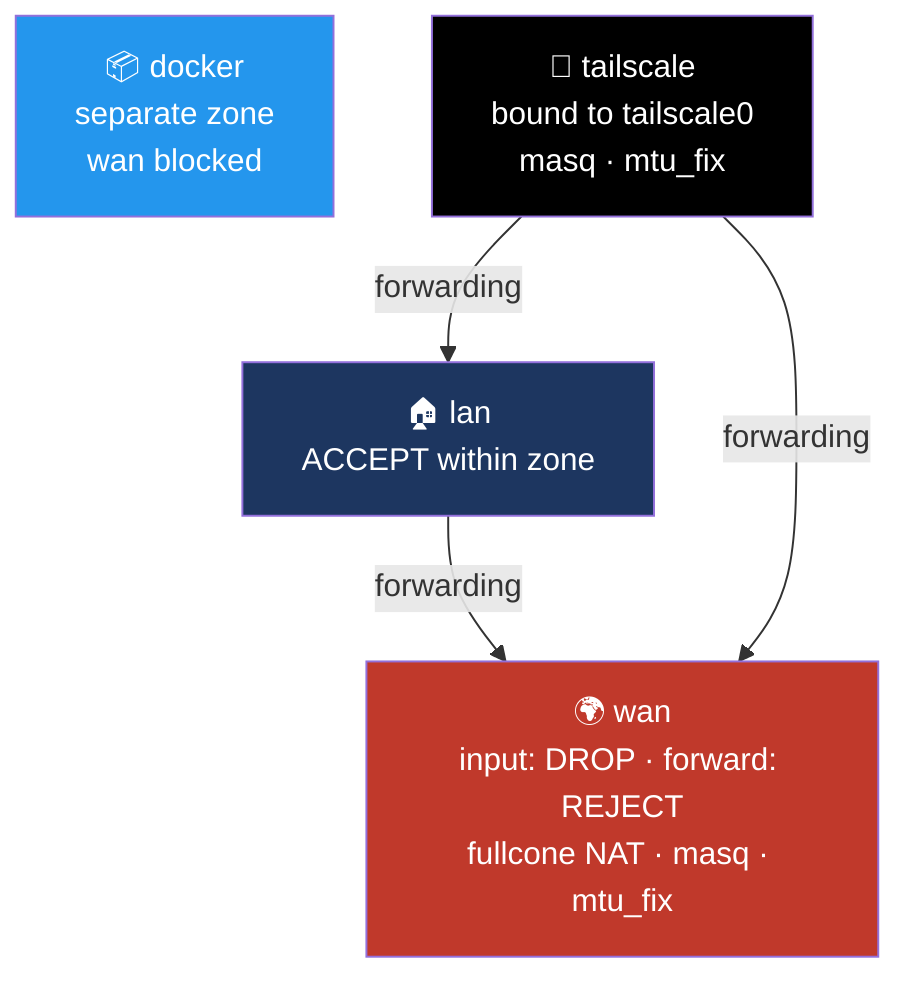

# 📡 Router & Network — FriendlyWRT on NanoPi R6S

The router is the core of this homelab: it terminates the WAN connection, runs the full DNS stack, enforces firewall policy, hosts Docker, and handles QoS and monitoring. This document covers every meaningful configuration decision made on it.

> ⚠️ All IP addresses, hostnames, MAC addresses, interface names and credentials referenced below are illustrative placeholders — not real values from my network.

## 🖥️ Platform

| Component | Detail |
|---|---|
| Hardware | NanoPi R6S (Rockchip RK3588S, 8-core, 2× 2.5GbE + 1× 1GbE) |
| OS | FriendlyWRT (OpenWrt-based) |
| Boot / Storage | Boots from onboard eMMC (`boot_from_emmc`) |
| Firewall backend | `nftables` (firewall4) |
| Timezone / NTP | Europe/Istanbul, with a 4-server NTP pool for redundancy |

---

## 🌍 WAN — PPPoE Termination

The router terminates the ISP connection directly over **PPPoE on a tagged VLAN**, rather than leaving the ISP-supplied modem in router mode. This puts NAT, firewall and DNS entirely under my control instead of behind a second, opaque NAT layer.

Key decisions:

- **`peerdns '0'`** — the WAN interface refuses to accept the DNS servers the ISP pushes during PPPoE negotiation. This is the *first* of three independent layers preventing ISP DNS from ever being used (see the DNS chain below).
- **WAN DNS pinned to `127.0.0.1`** — the router resolves through its own local stack, not upstream.
- **`mtu '1492'`** — the correct PPPoE MTU (1500 minus the 8-byte PPPoE header). Paired with `mtu_fix` on the WAN firewall zone, which applies MSS clamping so TCP sessions negotiate a segment size that actually fits, avoiding the classic "some HTTPS sites hang forever" PMTU black-hole problem.
- **`norelease '1'`** — the session isn't torn down cleanly on reconfiguration, which keeps the ISP from re-assigning a different address on every minor config change.
- **A dedicated, normally-disabled `ONT_Access` interface** sits on the same physical port with a static address in the modem's own management subnet. It's set to `auto '0'`, so it stays down during normal operation and can be brought up on demand only when I need to reach the ONT's web interface for diagnostics — without permanently exposing that management subnet to the LAN.

---

## 🔗 DNS Chain

The goal: a resolution path that is **encrypted end to end**, **filtered network-wide**, **fast via local caching**, and **impossible to bypass** from a client device.

### 1️⃣ dnsmasq — DHCP + first-hop resolver

- Serves DHCP and resolves local `.lan` hostnames, with `expandhosts` and `readethers` so statically-known hosts resolve without extra configuration.
- **`noresolv '1'` + `no-resolv` in `/etc/dnsmasq.conf`** — dnsmasq never reads `/etc/resolv.conf`. Without this, whenever the upstream chain hiccuped, dnsmasq would silently fall back to whatever resolver the WAN handed out, defeating the entire encrypted path without any visible error. This is the second of the three anti-leak layers.
- **All non-local queries forwarded to `127.0.0.1#6053`** — a single explicit upstream, straight into SmartDNS.
- **`cachesize '1000'`** — a modest front-line cache, since the real caching happens one layer down in SmartDNS.
- **`ednspacket_max '1232'`** — caps EDNS payload size at the value recommended by the DNS Flag Day guidance, avoiding fragmented UDP responses that some middleboxes silently drop.
- **`filter_aaaa '1'`** — suppresses AAAA answers to LAN clients. A deliberate trade-off: native IPv6 from the ISP is inconsistent, and clients that received AAAA records would prefer IPv6 and stall before falling back. Filtering at the resolver forces reliable IPv4 paths.
- **`rebind_protection '0'`** — DNS rebinding protection is off, because several self-hosted services legitimately resolve to private addresses and were being blocked by it. The exposure is limited: `localservice` restricts DNS to local subnets, and `rebind_localhost` still guards loopback specifically.

### 2️⃣ SmartDNS — caching, dual-stack selection, filter enforcement point

- Listens on `6053`, with a secondary instance on `6553` used for testing changes without disrupting the live path.
- **`dualstack_ip_selection`** — when both A and AAAA records exist, SmartDNS actively measures and returns the faster of the two rather than blindly preferring IPv6.
- **`serve_expired` + `cache_persist`** — stale entries keep being served while a refresh happens in the background, and the cache survives a reboot. On a home connection this is the difference between "the internet is down for 30 seconds after a router restart" and nobody noticing.
- **`rr_ttl_min '600'`** — enforces a 10-minute floor on TTLs, overriding CDNs that hand out 30-second TTLs and would otherwise generate constant upstream queries.
- **`force_https_soa`** — returns an empty SOA for HTTPS/SVCB record types, which prevents clients from discovering and switching to their own DoH endpoints and bypassing this chain.
- **`bind_device`** — binds the listener to a specific device rather than all addresses, limiting exposure.
- **Two independent upstreams**, each pointed at a *local* DoH proxy instance rather than a public IP directly. SmartDNS can fail over between providers without any client noticing.

### 3️⃣ HTTPS DNS Proxy — DoH termination

- Two instances run in parallel, one per provider (Quad9 and Cloudflare), each listening on its own loopback port and each bootstrapping via that provider's plain resolver IPs before switching to `https://.../dns-query`.
- **`force_dns` with ports `53` and `853`, scoped to `src_interface lan`** — this transparently redirects any device that hardcodes its own DNS server (port 53) or DNS-over-TLS resolver (port 853) back into the chain. This is the third and final anti-bypass layer, and the one that covers smart TVs and IoT devices that ship with hardcoded resolvers.
- **`canary_domains_icloud` + `canary_domains_mozilla`** — answers the special "canary" domains that Firefox and Apple devices query to decide whether to enable their own built-in DoH. Responding correctly makes those clients *voluntarily* disable their private DoH and use the network resolver — which is what makes network-wide filtering actually work on them.
- **`notrack_dns`** — exempts DNS from connection tracking. DNS generates a very high rate of short-lived flows; keeping them out of the conntrack table meaningfully reduces table pressure on an embedded device.
- **`listen_addr '127.0.0.1'`** — the proxies are only reachable from the router itself, never from the LAN.

### 🚫 Adblock

- Uses the **Hagezi "ultimate" wildcard** blocklist feed.
- Critically, it's bound to the **SmartDNS instance** (`adb_dns 'smartdns'`, `adb_dnsinstance '6053'`) rather than to dnsmasq. Filtering therefore happens at the same hop that everything is forced through, so no client can escape it, and the blocklist doesn't have to be reloaded into dnsmasq's own cache.
- `adb_fetchretry '5'` handles the case where the router boots and tries to fetch lists before the PPPoE session is fully up.

---

## 🧱 Firewall

- **Deny by default**: global policy is `input REJECT` / `forward REJECT`, with `synflood_protect` and `drop_invalid` enabled. The WAN zone specifically overrides input to **`DROP`** rather than `REJECT` — the router stays silent to unsolicited probes instead of advertising its presence with an ICMP rejection.
- **`fullcone4` / `fullcone6` NAT** on WAN instead of the default symmetric NAT. Symmetric NAT breaks peer-to-peer NAT traversal (VoIP, game consoles, WebRTC) and forces traffic through relay servers; full-cone lets those protocols establish direct connections.
- **A dedicated `docker` firewall zone** with `wan` listed in `blocked_interfaces`. Containers get their own firewall context rather than being lumped into `lan`, so container egress and container-to-LAN reachability are governed separately from regular clients.
- **A dedicated `tailscale` zone** bound directly to the `tailscale0` device, with its own masquerade and `mtu_fix`, plus explicit forwarding rules to both `lan` and `wan`. This is what lets remote tailnet devices reach local LAN services *and* route their general internet traffic out through this router (exit-node behaviour) — the `mtu_fix` matters because WireGuard's encapsulation overhead otherwise causes the same PMTU black-holing described in the WAN section.
- **Inbound allowances are kept to the functional minimum**: DHCP renewal, ping, IGMP, IPSec/ISAKMP passthrough, and a rate-limited set of ICMPv6 types. The ICMPv6 rules are not optional decoration — IPv6 fundamentally depends on ICMPv6 for neighbour discovery and PMTU discovery, so blanket-blocking ICMP (a common instinct) breaks IPv6 entirely. They're rate-limited to 1000/sec to blunt flood attempts.

---

## 🚦 QoS — SQM with CAKE

- **`cake` qdisc** via the `piece_of_cake.qos` script on the WAN device, shaped just below the true line rate in both directions.
- The point is **bufferbloat elimination**, not raw throughput. Without shaping, the ISP's oversized buffers fill during any sustained upload and latency spikes into the hundreds of milliseconds — video calls stutter and games become unplayable while someone uploads a file. Shaping slightly below line rate moves the queue into the router, where CAKE can manage it fairly.
- **`overhead '44'` with `linklayer 'ethernet'`** — accounts for PPPoE plus VLAN tagging encapsulation, so the shaper's accounting matches what actually goes on the wire. Getting this wrong means the shaper is quietly mis-calibrated.
- An earlier, more conservative queue definition is retained but disabled, so I can flip back to known-good settings if a change misbehaves.
- `nft-qos` (per-client static rate limiting) is installed but left disabled — CAKE's fair queueing already handles contention between clients without hard per-device caps.

---

## ⚙️ System & Performance Tuning

This is an 8-core RK3588S pushing multi-gigabit interfaces, so several defaults needed adjusting:

- **`packet_steering '2'` with `steering_flows '128'`** — enables receive packet steering across all CPU cores. By default network interrupt handling concentrates on a single core, which becomes the bottleneck well before the interfaces saturate. Spreading flows across cores is what makes the 2.5GbE ports usable at full speed.
- **CPU governor forced to `performance` at boot** via `/etc/rc.local`, iterating over every cpufreq policy. The `conservative` governor left in the cpufreq config ramps up too slowly, adding latency to bursty network workloads; on a device that's always on and thermally unconstrained, the power saving isn't worth the jitter.
- **`https-dns-proxy` restarted 15 seconds after boot**, also from `rc.local`. This works around a genuine startup race: the DoH proxies start before the PPPoE session has finished negotiating, fail to resolve their own bootstrap endpoints, and stay in a broken state. Delaying a restart until the WAN is actually up fixes DNS-on-cold-boot deterministically.
- **OpenSSL `devcrypto` engine and legacy provider enabled** — routes cryptographic operations to the SoC's hardware crypto engine rather than doing them in software.
- **LED triggers** bound to link state on each physical port, so the front-panel LEDs actually indicate WAN/LAN activity at a glance.
- **`ddns` explicitly disabled** via a `uci-defaults` script, so it stays off across firmware upgrades rather than being silently re-enabled by a package default.
- **A cron job prunes oversized logs in `/tmp` every minute.** `/tmp` is a RAM-backed tmpfs on this platform — a runaway log file doesn't fill a disk, it consumes system memory until things start failing in confusing ways. Capping log size is a hard requirement on embedded hardware, not housekeeping.

---

## 📦 Docker Host

- **`data_root` relocated to `/opt/docker`**, which is a **dedicated ext4 partition on the eMMC** mounted via fstab with `noatime`.
- This matters a lot on OpenWrt: by default the writable filesystem is an overlay on the small firmware partition. Running Docker there fills it almost immediately, and a full overlay on OpenWrt causes strange, hard-to-diagnose failures across unrelated services. A separate partition isolates container storage completely and survives firmware upgrades.
- `noatime` avoids a metadata write on every file read — meaningful for both flash wear and throughput on eMMC.
- Docker's firewall integration is left enabled but constrained by the dedicated `docker` firewall zone described above.

---

## 📊 Monitoring & Observability

- **`nlbwmon`** — per-host bandwidth accounting, with monthly accounting periods and 10 retained generations. Answers "which device is consuming the connection" historically, not just live.
- **`collectd` + `luci_statistics` with RRDtool** — long-term graphing, with only the plugins that matter enabled (CPU, load, memory, interface throughput) rather than the full default plugin set. Each enabled plugin costs RAM and periodic writes, so on an embedded device this is a deliberate trim rather than leaving everything on.
- Console and cron log verbosity raised, with a bounded in-memory log buffer.

---

## 🔐 Remote Access

- **Tailscale** provides remote access, running with `fw_mode 'nftables'` to match the firewall backend rather than falling back to iptables compatibility shims. It has its own firewall zone and advertises routes to the LAN.
- **LuCI over HTTPS** with `redirect_https` forcing plaintext requests to upgrade, using a self-signed certificate generated with a SAN-compliant configuration (browsers reject certificates that only carry a Common Name, so the certificate had to be generated manually with OpenSSL rather than with the stock helper).
- **`rfc1918_filter`** on the web server rejects requests that arrive from a public source address but target a private one — a DNS-rebinding defence for the admin interface specifically.

---

## 🧰 Installed But Intentionally Idle

Several packages are installed and configured but deliberately left disabled, either because they were evaluated and rejected or because they're kept ready for a specific occasion:

| Package | Status | Reason |
|---|---|---|
| AdGuard Home | Disabled | Evaluated as an alternative to the SmartDNS + Adblock combination; the current chain gives finer control over the DoH layer |
| `nft-qos` | Disabled | Redundant alongside CAKE's fair queueing |
| miniupnpd | Disabled | UPnP/NAT-PMP lets any LAN device open inbound ports on its own; kept configured with `secure_mode` and a default-deny rule in case it's ever needed |
| minidlna / aria2 | Disabled | Superseded by containerised equivalents on the Docker host |
| hd-idle | Disabled | No spinning disks currently attached |
| DDNS | Disabled | Explicitly disabled at boot; no dynamic DNS requirement at present |

---

## 🛠️ Stack

`OpenWrt/FriendlyWRT` · `nftables / firewall4` · `dnsmasq` · `SmartDNS` · `HTTPS DNS Proxy (DoH)` · `Adblock (Hagezi)` · `SQM / CAKE` · `Tailscale` · `Docker` · `collectd + RRDtool` · `nlbwmon` · `PPPoE`
