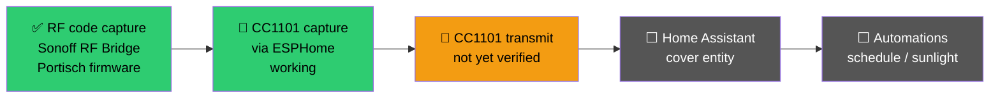

# 🏡 Smart Home — Work in Progress

> 🚧 **Under construction.** This is an early-stage effort, documented here as a running log of intent, hardware, and progress rather than a finished write-up. It will be filled in properly (configs, diagrams, working automations) as the project matures.

## 🎯 Goal

Integrate RF-controlled roller blinds (Mosel-brand motors) into Home Assistant, so they can be automated alongside the rest of the smart-home stack described in [`docker/`](../docker) — scheduled by time of day, sunlight, or presence, rather than only operated from their original RF remote.

## 🔩 Hardware in Use

| Component | Purpose |
|---|---|
| Sonoff RF Bridge R2 (flashed with Portisch firmware) | Captures raw RF codes from the existing blind remotes |
| CC1101 + ESP8266, via ESPHome | Intended long-term RF transceiver — capture and (eventually) transmit |
| Mosel roller blind motors | The actual devices being controlled, driven by their stock 433 MHz RF remotes today |

## 🗺️ Current Status

- ✅ **RF capture working** — raw codes from the Mosel remotes have been successfully captured using the Sonoff RF Bridge running Portisch's custom firmware, which exposes the underlying RF codes rather than the stock firmware's cloud-only B0/B1 format.
- ✅ **CC1101 capture via ESPHome working** — the CC1101 module can also receive and decode the same signals.
- 🚧 **CC1101 transmit not yet verified** — sending the captured codes back out to actually move a blind hasn't been confirmed working yet. This is the current blocker.
- ⬜ **Home Assistant integration** — not started. Once transmit is reliable, the next step is exposing the blinds as `cover` entities.
- ⬜ **Automations** — scheduling, sunlight-based control, presence-based control. Depends on everything above.

## 📋 Planned Next Steps

1. **Get reliable RF transmit working** from the CC1101/ESPHome side — likely a matter of matching timing and modulation parameters to what the remotes actually send, rather than replaying captured bytes verbatim. *Benefit:* this is the gate everything else depends on; until it works, the blinds remain manual-only.
2. **Expose blind control as a proper ESPHome `cover` component** rather than one-off RF replay scripts. *Benefit:* Home Assistant then treats the blinds as first-class devices with position state, so they work in the dashboard, in voice assistants, and in automations without custom glue for each.
3. **Build the actual automations** — close at sunset, open at sunrise, close when outdoor temperature is high. *Benefit:* the practical payoff — reduced solar heat gain in summer (and therefore lower cooling load) and blinds that no longer need to be operated manually twice a day.
4. **Document the full capture → decode → replay pipeline** once it's stable. *Benefit:* the same pipeline applies to any 433 MHz device, so writing it up once makes every future RF integration a repeat of a known process rather than a fresh investigation.

## 🎓 Why Do This At All

The blinds could be replaced with off-the-shelf smart motors. Building an RF bridge instead is deliberate: it keeps the existing hardware in service, avoids adding another cloud-dependent device to the network, and means everything runs locally on infrastructure I control — consistent with the rest of this homelab, where the DNS chain and firewall exist precisely to keep devices from depending on outside services. It's also a genuinely useful exercise in working from a signal up: capture, decode, understand the protocol, then reproduce it.

## 🔭 Longer-Term Vision

The roller blind work above is the first piece of a broader plan for the space. Once it's stable, the intended scope expands to:

| Area | Goal |
|---|---|
| 💡 Light switches & outlets | Retrofit smart switches/outlets so lighting and plugged devices are controllable and automatable, not just the blinds |
| 🚶 Presence sensors | Occupancy-based automation — lighting and blinds reacting to whether a room is actually in use, rather than on a fixed schedule alone |
| 💧 Water leak sensors | Early detection near appliances/plumbing most likely to fail, with an alert path independent of whether anyone is home |
| 🚪 Door/window sensors | Contact sensors feeding both security automations (e.g. don't run the AC with a window open) and basic intrusion awareness |
| 📷 Privacy-conscious cameras | Camera coverage limited to points of interest (entryways, common areas), deliberately excluding private spaces — placement and field of view chosen for security value without turning the home into a surveillance environment |

None of this is built yet — it's included here to be transparent about direction, and because the roller blind pipeline (RF handling, ESPHome device management, Home Assistant integration patterns) is meant to be the reusable foundation the rest of this is built on top of, rather than a one-off.

## 🛠️ Stack (so far)

`ESPHome` `CC1101` `ESP8266` `Sonoff RF Bridge R2` `Portisch firmware` `Home Assistant` (planned)
